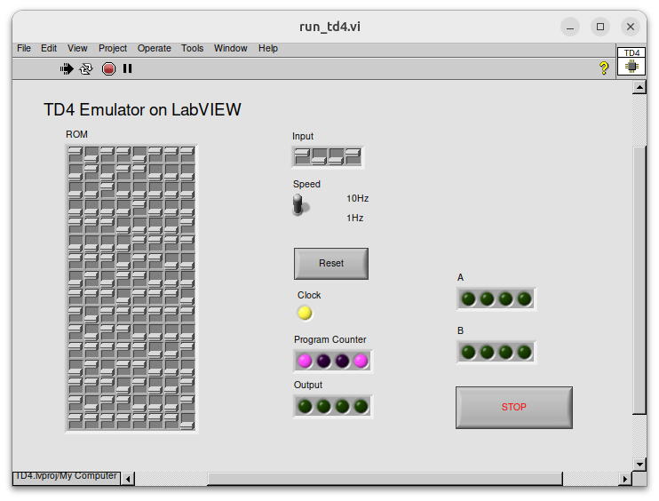
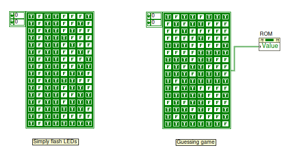

# TD4 Emulator on LabVIEW
「[CPUの創りかた][CPU_book_link]」でおなじみのTD4 CPUのエミュレータをLabVIEW上で実装しました。



## 起動方法
`src/TD4.lvproj`を開き、`run_td4.vi`を実行します。
LabVIEW 2025Q1で作成しています。

## 実行可能な命令について
下記の命令が実行可能です。
データ転送系命令（MOV, IN, OUT）が全加算器を通る仕様を再現しているため、これらの命令のImデータに数値を入力することで転送 + 加算が1命令で実行できます。

```assembly
ADD A, Im       ; 0000xxxx  AレジスタにImの内容を加算、オーバーフローした場合はキャリーフラグをセット
ADD B, Im       ; 0101xxxx  BレジスタにImの内容を加算、オーバーフローした場合はキャリーフラグをセット
MOV A, Im       ; 0011xxxx  AレジスタにImの内容を転送
MOV B, Im       ; 0111xxxx  BレジスタにImの内容を転送
MOV A, B + Im   ; 0001xxxx  Bレジスタ + Imの内容をAレジスタに転送
MOV B, A + Im   ; 0100xxxx  Aレジスタ + Imの内容をBレジスタに転送
JMP Im          ; 1111xxxx  Imのアドレスにジャンプ
JNC Im          ; 1110xxxx  キャリーフラグが無ければImのアドレスにジャンプ
IN + Im  A      ; 0010xxxx  INPUT + Imの内容をAレジスタに転送
IN + Im  B      ; 0110xxxx  INPUT + Imの内容をBレジスタに転送
OUT B + Im      ; 1001xxxx  Bレジスタ + Imの内容をOUTPUTに表示
OUT Im          ; 1011xxxx  Imの内容をOUTPUTに表示

; ※下位4-bitのxxxxはImデータを表しています。
```

## 起動時のTD4向けプログラムについて
起動時にデフォルトで数当てゲームが実行されるようになっています。
ブロックダイアグラムの以下の定数を変更、あるいは繋ぎ変えたりすることで、実行されるTD4のコードを変更できます。



数当てゲームのソースと解説は[こちらのgist](https://gist.github.com/woodrush/6e562738c43479907635425ed85d9910)をぜひご覧ください。

## 参考
[CPUの創りかた][CPU_book_link]

[CPU_book_link]: https://book.mynavi.jp/ec/products/detail/id=22065